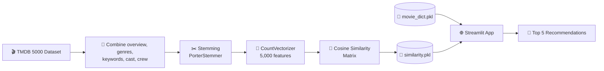

<div align="center">

# 🎬 Movie Recommendation System

### *Can't decide what to watch? Let cosine similarity pick for you.*

<br>


[](https://movie-recommendation-system-hggv3rsf7watxb2xyvo9sb.streamlit.app/)

<br>

**[🚀 Live Demo](https://movie-recommendation-system-hggv3rsf7watxb2xyvo9sb.streamlit.app/)** &nbsp;•&nbsp;
**[✨ Features](#-features)** &nbsp;•&nbsp;
**[🧠 How It Works](#-how-it-works)** &nbsp;•&nbsp;
**[🛠️ Run Locally](#️-run-locally)** &nbsp;•&nbsp;
**[🌐 Deploy](#-deploy-on-streamlit-cloud)**

</div>

---

## 🚀 Live Demo

<div align="center">

### 👉 **[Try it on Streamlit Cloud](https://movie-recommendation-system-hggv3rsf7watxb2xyvo9sb.streamlit.app/)** 👈


</div>

---

## ✨ Features

| | Feature | Description |
|---|---|---|
| 🎞️ | **4,800+ movies** | Pick any title from the dropdown |
| ⚡ | **Instant results** | Get 5 similar movies in one click |
| 🖼️ | **Live posters** | Fetched from multiple free sources, no API key needed |
| 🚄 | **Parallel fetching** | All 5 posters load at the same time |
| 🛟 | **Graceful fallback** | Shows a clean "No poster" card if nothing is found |

---

## 🧠 How It Works



### 1️⃣ Data preparation *(offline, in a Jupyter notebook)*

- Combine `overview`, `genres`, `keywords`, `cast` and `crew` into a single **`tags`** field
- Stem the text with NLTK's **`PorterStemmer`**
- Vectorize with **`CountVectorizer`** (5,000 features, English stop words)
- Compute **cosine similarity** between all movie vectors

### 2️⃣ Streamlit app *(`app.py`)*

- Loads `movie_dict.pkl` and `similarity.pkl`
- On selection, finds the **top 5** most similar movies
- Fetches posters in parallel, trying each source in order:

```
🍎 iTunes  ──▶  🎥 IMDb  ──▶  📚 Wikipedia
```

---

## 🧰 Tech Stack

| Layer | Tools |
|---|---|
| **Frontend** | Streamlit |
| **ML / NLP** | scikit-learn, NLTK |
| **Data** | Pandas, NumPy |
| **Posters** | iTunes Search API, IMDb suggestion endpoint, Wikipedia REST API |

---

## 📂 Project Structure

```
.
├── 📄 app.py              # Streamlit application
├── 📦 movie_dict.pkl      # movie data (titles, tags, ids)
├── 📦 similarity.pkl      # cosine similarity matrix
├── 📋 requirements.txt    # Python dependencies
├── 📖 README.md
└── 🙈 .gitignore
```

---

## 🛠️ Run Locally

```bash
# 1. Clone the repo
git clone https://github.com/hima879/Movie-Recommendation-System.git
cd Movie-Recommendation-System

# 2. Create a virtual environment
python -m venv venv
source venv/bin/activate        # Windows: venv\Scripts\activate

# 3. Install dependencies
pip install -r requirements.txt

# 4. Launch the app
streamlit run app.py
```

🌍 Opens at **http://localhost:8501**

<details>
<summary><b>📋 Example <code>requirements.txt</code></b></summary>

<br>

```
streamlit
pandas
requests
```

</details>

---

## 🌐 Deploy on Streamlit Cloud

1. 📤 Push this repo to **GitHub**
2. 🔗 Go to [share.streamlit.io](https://share.streamlit.io)
3. ➕ Click **New app** and pick this repo, the `main` branch and `app.py`
4. 🎉 Hit **Deploy**

---

## 📊 Dataset

Built on the [**TMDB 5000 Movie Dataset**](https://www.kaggle.com/datasets/tmdb/tmdb-movie-metadata) from Kaggle.

---

## 📜 License

Released under the **MIT License**. Free to use and modify.

---

## 🙏 Acknowledgements

- 🖼️ Poster sources: **iTunes Search API**, **IMDb suggestion endpoint**, **Wikipedia REST API**
- 💡 Inspired by the classic content-based filtering tutorial by **CampusX**

---

<div align="center">

### ⭐ If you liked this project, give it a star!

Made with ❤️ and 🍿

</div>
